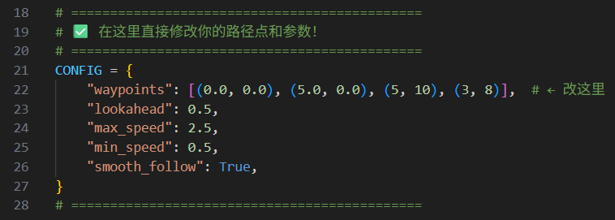
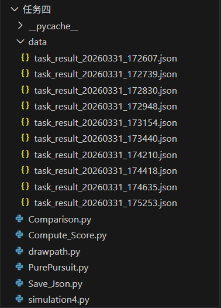
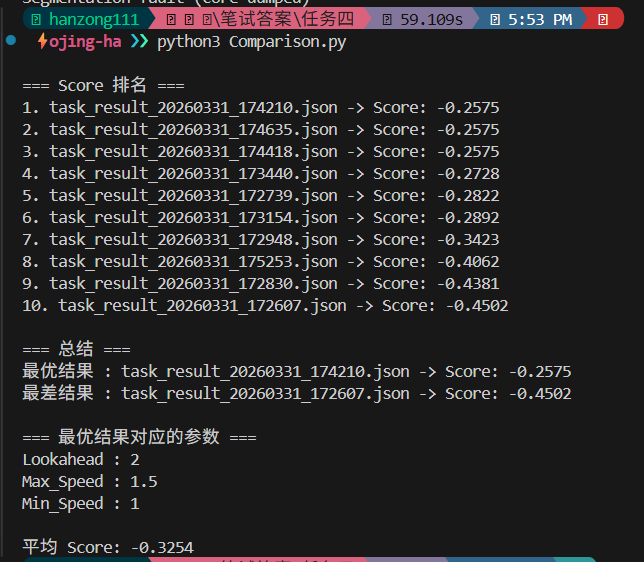
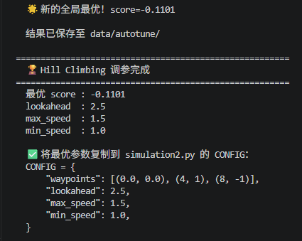
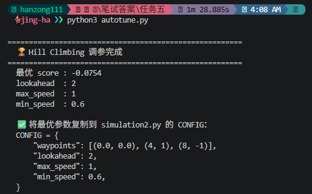

# 无人驾驶机器人仿真项目

> 基于 PyBullet 仿真环境，实现机器人路径跟踪控制、数据采集、性能评估与自动调参。
> 由于本机 GPU 算力不足，选用 PyBullet 作为 Isaac Sim 的替代仿真环境。

---

## 目录

- [环境要求](#环境要求)
- [快速开始](#快速开始)
- [任务一 — 仿真环境搭建](#任务一--仿真环境搭建)
- [任务二 — 路径跟踪控制](#任务二--路径跟踪控制)
- [任务三 — 仿真数据采集](#任务三--仿真数据采集)
- [任务四 — 评估系统](#任务四--评估系统)
- [任务五 — 自动调参](#任务五--自动调参)
- [任务六 — 可视化](#任务六--可视化)

---

## 环境要求

| 项目 | 要求 |
|---|---|
| Python | 3.8 或更高版本 |
| 包管理器 | pip |
| 推荐系统 | Ubuntu 20.04+ / Windows WSL2 |

---

## 快速开始

```bash
# 1. 创建虚拟环境
python3 -m venv myvenv

# 2. 激活虚拟环境（Linux / macOS）
source myvenv/bin/activate

# 3. 安装依赖
pip install -r requirements.txt
```

---

## 任务一 — 仿真环境搭建

**任务要求**
- 支持控制机器人运动（线速度 v + 角速度 ω）
- 能成功启动仿真环境
- 机器人可正常运动

**运行方式**

```bash
cd 任务一
python3 simulation1.py
```

**运行后提示**

```
=== 机器人运动控制（真实汽车）===
============= 前进 ============
前进线速度 v (默认 2.0): *
============= 转弯 ============
转弯线速度 v (默认 1.0): *
转弯角速度 ω (默认 1.0 rad/s): *
```

---

## 任务二 — 路径跟踪控制

**任务要求**
- 实现路径跟踪算法
- 输入：二维路径点 `[(0,0), (1,0), (3,5) ...]`
- 输出：线速度 v + 角速度 ω

**运行方式**

```bash
cd 任务二
python3 simulation2.py
```

在 `simulation2.py` 顶部的 `CONFIG` 修改路径点和参数：




### 算法说明 — Pure Pursuit

> 不看脚下，看前方。在路径上找一个「前视点」，计算需要转多少角度才能到达，然后输出对应的线速度 v 和角速度 ω。

**算法流程**

```
1. 获取机器人当前位置和朝向（yaw）
2. 在路径上向前找一个距离为「前视距离」的目标点
3. 计算目标点相对于机器人朝向的角度差
4. 角度差越大 → 转得越急（ω 越大）
5. 角度差越大 → 速度越慢（避免甩尾）
6. 输出 v 和 ω，控制车轮转动
7. 重复，每一帧都重新计算
```

**速度控制逻辑**

```python
v = max_speed × (1.0 - 0.5 × |角度差|)   # 角度差越大，速度越慢
v = 限制在 [min_speed, max_speed] 之间

ω = 1.5 × 角度差                          # 角度差直接转换为角速度
ω = 限制在 [-1.0, 1.0] 之间
```

**前视距离的影响**

| 前视距离 | 效果 |
|---|---|
| 太小 | 反应过度，路径震荡，像蛇形走位 |
| 太大 | 走捷径，转弯切角，误差变大 |
| 适中 ✅ | 平滑跟踪，误差小，稳定 |

**可调参数**

| 参数 | 作用 |
|---|---|
| `lookahead_distance` | 前视距离，控制平滑程度 |
| `max_speed` | 最大线速度，直线段全速 |
| `min_speed` | 最小线速度，急转弯时的下限 |

---

## 任务三 — 仿真数据采集

**任务要求**
- 记录机器人轨迹（x, y）
- 记录路径误差（tracking error）
- 记录控制输出（v, ω）

**运行方式**

```bash
cd 任务三
python3 simulation3.py
```

跑完后会生成 `task_result.json`，内容如下：

```json
{
    "Trajectory": [...],
    "Error": [...],
    "controls": [...]
}
```

**路径误差计算逻辑**

计算机器人当前位置到路径上每一条线段的最短距离，取最小值作为当前误差：

```python
error = min_distance_to_path(pos, waypoints)
```

---

## 任务四 — 评估系统

**任务要求**
- 设计评分函数评估路径跟踪效果
- 支持多次仿真结果对比

**运行方式**

```bash
cd 任务四
python3 Comparison.py
```

### 算法说明 — 评分函数

分数越高（越接近 0）表示表现越好。

**评分公式**

```
score = -(RMSE + 0.3 × 晃动率)
```

| 指标 | 说明 |
|---|---|
| RMSE | 均方根误差，衡量轨迹与路径的平均偏差，偏差越大惩罚越重 |
| 晃动率 | 角速度 ω 正负切换频率，切换越频繁说明机器人来回摆动 |
| 0.3 | 晃动惩罚权重，可调整 |

**实验结果对比**

所有仿真结果保存在 `data/` 文件夹，`Comparison.py` 会自动读取并排名：





---

## 任务五 — 自动调参

**任务要求**
- 自动尝试多组参数
- 输出最优参数组合

**运行方式**

```bash
cd 任务五
python3 autotune.py
```

在 `autotune.py` 顶部修改搜索范围：

```python
WAYPOINTS = [(0.0, 0.0), (4, 1), (8, -1)]

PARAM_BOUNDS = {
    "lookahead": [1,  5, 0.5],
    "max_speed": [1,  5, 0.5],
    "min_speed": [0.5, 3, 0.5],
}
```
### `PARAM_BOUNDS` 参数范围说明
 
每个参数的格式为 `[最小值, 最大值, 步长]`：
 
```python
PARAM_BOUNDS = {
    "lookahead": [1,   5, 0.5],  # 从 1.0 开始，每次 +0.5，最大到 5.0
    "max_speed": [1,   5, 0.5],  # 从 1.0 开始，每次 +0.5，最大到 5.0
    "min_speed": [0.5, 3, 0.5],  # 从 0.5 开始，每次 +0.5，最大到 3.0
}
```
 
| 字段 | 含义 | 例子 |
|---|---|---|
| 最小值 | 参数的最低取值 | `lookahead` 最小为 `1.0` |
| 最大值 | 参数的最高取值 | `lookahead` 最大为 `5.0` |
| 步长 | 每次尝试的增减幅度 | `0.5` → 尝试 `1.0, 1.5, 2.0, 2.5 ...` |
 
> 步长越小，搜索越精细，但运行时间越长。建议先用大步长（`0.5`）粗调，再用小步长（`0.1`）细调。

### 算法说明 — Hill Climbing（爬山算法）

> 每一步都朝着评分更高的方向走，直到到达局部最优为止。多次随机重启以避免卡在局部最优。

**算法流程**

```
1. 随机选择一组起始参数（前视距离、最大速度、最小速度）
2. 对每个参数分别尝试「+一步」和「-一步」
3. 移动到评分最高的邻居
4. 重复，直到所有邻居都比当前更差 → 到达局部最优，停止
5. 重新从另一个随机起点出发（共重启 5 次）
6. 返回所有重启中最好的结果
```

**举例说明**

```
起始：lookahead=1.5, max_speed=2.0, min_speed=1.0 → 评分 = -0.85
尝试：lookahead=2.0 → 评分 = -0.71  ✅ 更好，移动
尝试：lookahead=2.5 → 评分 = -0.68  ✅ 更好，移动
尝试：lookahead=3.0 → 评分 = -0.79  ❌ 更差，不动
尝试：max_speed=2.5 → 评分 = -0.61  ✅ 更好，移动
...
所有邻居都更差 → 停止，输出当前最优参数
```

**搜索参数范围**

| 参数 | 最小值 | 最大值 | 步长 |
|---|---|---|---|
| `lookahead` | 0.5 | 4.0 | 0.5 |
| `max_speed` | 1.0 | 4.0 | 0.5 |
| `min_speed` | 0.5 | 2.5 | 0.5 |

---

## 任务六 — 可视化

**任务要求**
- 绘制机器人轨迹
- 对比不同参数效果
- 展示调参过程

### 机器人轨迹

红线为目标路径 `WAYPOINTS`，蓝线为实际轨迹：


### 调参过程演示

**第一轮：粗调（大步长）**

运行 `autotune.py`，使用大步长快速找到大致范围：



**第二轮：细调（小步长）**

根据第一轮结果缩小范围，减小步长：

```python
PARAM_BOUNDS = {
    "lookahead": [2, 3, 0.1],   # 步长从 0.5 缩小到 0.1
    "max_speed": [1, 2, 0.1],
    "min_speed": [0.5, 1.5, 0.1],
}
```

评分从 `-0.1101` 优化至 `-0.0754`：



**最终参数**

```python
CONFIG = {
    "waypoints": [(0.0, 0.0), (4, 1), (8, -1)],
    "lookahead": 2.0,
    "max_speed": 1.0,
    "min_speed": 0.6,
}
```

**最终效果演示**

<video controls src="Screen Recording 2026-04-03 042244.mp4" title="最终仿真效果"></video>